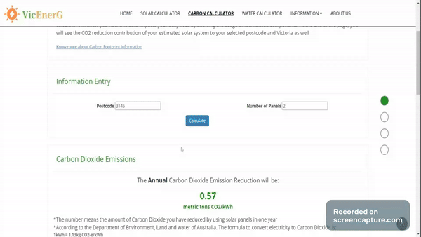

# VicEnerG - Victorian Energy Solutions Project

## Introduction

### Purpose
According to news, due to the lockdown during the Covid-19, residential energy consumption has risen between 15 and 29 percent, and it leads Australians to pay more than $17 million worth of electricity bills. Victorians may not be able to afford the payment without an efficient way if the lockdown continues. Thus, we developed the VicEnerG for residents to solve this problem.

VicEnerG aimed to provide detailed information about green energy technologies to Victorian families. It focuses on the construction of a website containing essential information on energy saving, calculations related to solar power, water recycling and carbon emission to provide a broader knowledge to consumer to better understanding how they can save energy and environment.

All the data was retrieved from the Open Data Provider:
1. [Request point climate data from 1889 to yesterday](https://www.longpaddock.qld.gov.au/silo/point-data/#responseTab2)
2. [Postcode data for small-scale installations-SGU-Solar](http://www.cleanenergyregulator.gov.au/DocumentAssets/Pages/Postcode-data-for-small-scale-installations---SGU-Solar.aspx)

## Fundamentals & Key Features

Our website, [VicEnerG](https://www.vicenerg.team), caters to Victorian families aged 30 to 45, offering information on solar panels and water recycling systems. Key features include:

### **Solar Calculator:**    
 Empowers users to estimate their solar panel system's output for 12 months by entering postcode and panel details.     
 
  The Electricity Output section displays the estimated annual electricity output for the entered details, providing users with valuable insights. Furthermore, users can compare electricity outputs for different postcodes. The Appliance Usage feature converts the electricity output into the usage of various appliances, allowing users to make informed decisions about their energy consumption.
  

### **Water Calculator:**     
Focusing on rainwater harvesting as an effective water recycling method, this calculator estimates the amount of rainwater that can be harvested based on the given roof size of the property and its location. Users can input their roof size manually or draw it on the map, obtaining accurate calculations for water conservation.      

  The calculator provides valuable insights, including annual rainfall, total rainwater collection potential, and practical applications such as indoor and outdoor water usage.

### **Carbon Calculator:**    
Enables users to estimate their CO2 emissions reduction by inputting their postcode and the number of solar panels. Beyond displaying the reduction data, the calculator correlates it with real-world equivalents like vehicle miles, gasoline consumption, smartphone usage, and tree absorption. The feature emphasizes individual contributions to suburb and statewide carbon reduction, providing valuable insights into the environmental impact of solar panel installations        

## Product Video     
Inside doc folder, Product Video.mp4

## System Implementation

The web application is developed using ASP.NET Framework 4.8 and hosted on a Virtual Machine with Windows Server 2019 Data Centre. 

The data used for visualization is downloaded from [CLEAN ENERGY REGULATOR](http://www.cleanenergyregulator.gov.au/RET/Forms-and-resources/Postcode-data-for-small-scale-installations)

## Installation
1. Open the FIT5120- VicEnerG.sln solution folder. 
2. To import the initial database, please copy the App_Data folder into the FIT5120 - VicEnerG folder and choose to change all option.
3. Restore Nuget and rebuild project
4. Run the project with IIS.

